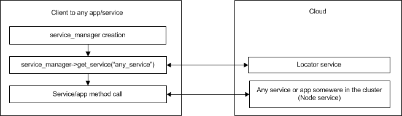
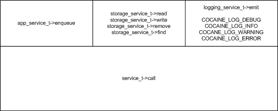

#C++ API

Logically API is divided in two parts:

  * [API for Cocaine apps writing](#api-for-writing-cocaine-apps);
  * [API for Cocaine services and apps usage (maintenance)](#client-api).
  
##API for Cocaine apps writing
C++ Cocaine app is an executable that will be started by `Node` service as a separate process. It has no access to internal Cocaine context unlike the Cocaine services that run inside of it. Cocaine apps can use services and other apps using [Client API](#client-api). How to write the Cocaine services you can read in [Plugins](plugins.md) section of documentation.

General approach to develop apps is to implement some handler classes and register them by `dispatch_t::on()`-call.

  * [Handlers](#handlers)
  * [App](#app)
  * [Example](#app-example)

###Handlers
Handlers contain functions, which called on client events and data. They should be derivatives from `handler` defined in `handler.hpp`. Also constructor of a handler should accept reference to instance of application.

```cpp
#include <cocaine/framework/handler.hpp>

class custom_app;

struct custom_handler :
    public cocaine::framework::handler<custom_app>,
    public std::enable_shared_from_this<custom_handler>
{
    custom_handler(custom_app &a) : cocaine::framework::handler<custom_app>(a){
        //some initialization code
    }

    //some code
};
```

`custom_app` is a class of app being developed. It is described later in this document.

####Callbacks
Handlers have a set of inherited public callback functions:

```cpp
virtual void on_invoke() {  //pass  }
virtual void on_chunk(const char *chunk, size_t size) = 0;
virtual void on_close() {  // pass  }
```

This functions are called by Cocaine worker on client request. App get all of the calls `on_invoke`, `on_chunk`, `on_close` in sequence. This means that `on_close` will not be called until `on_chunk` returns. These calls are thread-safe and there is no any limitation on using other API methods including Client API.

#####on_invoke
It is called on the client request. This call means, that stream from client to app is opened. You can do there some initializations that could not be done in constructor.

#####on_chunk
Data in `chunk` parameter are packed with the `msgpack`. It can be unpacked with the `cocaine::framework::unpack<_type_>(chunk, size)` call. For example, if we unpack data into the `string` this call will look like follows

```cpp
std::string data_str = cocaine::framework::unpack<std::string>(chunk, size);
```

#####on_close
Stream from the client closed. But the data to client still can be sent as back-to-client stream is opened. To get this stream you should use [response](#response) call.


####Other functions

  * `parent` - a `custom_app` instance;
  * `response` - back-to-client communication stream;
  * `event` - name of handled event.

#####parent
Returns `custom_app` instance, that allows use any public data and methods of app class from the handler.

```cpp
custom_app& parent() const
```

#####response
Returns pointer to the back-to-client stream object.

```cpp
std::shared_ptr response() const
```

Stream object has methods:

  * `error(int, std::string)` - to send an error to the client.
  * `close()` - to terminate connection with the client.
  * `write(<type>)` - to send data to the client. This method accepts as a parameter any type of objects that `msgpack` can treat and some more. Just try, if your type is not valid, program willn't be compiled.

##### event
Return the name of handled event.

```cpp
const std::string& event() const
```


###App
To be started as a Cocaine app program should have the next main function

```cpp
int main(int argc, char *argv[]) {
    return cocaine::framework::run<custom_app>(argc, argv);
}
```

`custom_app` is an ordinary class that should get the `cocaine::framework::dispatch_t` object reference in its constructor

```cpp
class custom_app {
public:
    custom_app(cocaine::framework::dispatch_t &dispatcher);
}
```

As the handler ([custom_handler](#handlers)) is ready to use, it should be registered for app.

```cpp
class custom_app {
public:
    custom_app(cocaine::framework::dispatch_t &dispatcher){
         dispatcher.on<custom_handler>("custom_handle", *this);
    }
}
```

`"custom_handle"` in this case is an external name of `custom_handler` that will be published for clients to app.


###App example
Following app is a simple calculator ([source](code_examples/api_cplusplus_calculator_app.cpp)). It have handles `add`, `subtract` and `get_value` with the corresponding meaning.

```
#include <cocaine/framework/dispatch.hpp>

class calculator;

//Handlers ========
struct add_handler :
                    public cocaine::framework::handler<calculator>, 
                    public std::enable_shared_from_this<add_handler>
{
    add_handler(calculator &calc) : cocaine::framework::handler<calculator>(calc)
    {}

    void on_chunk(const char *chunk, size_t size);
};

struct subtract_handler :
                    public cocaine::framework::handler<calculator>, 
                    public std::enable_shared_from_this<subtract_handler>
{
    subtract_handler(calculator &calc) : cocaine::framework::handler<calculator>(calc)
    {}

    void on_chunk(const char *chunk, size_t size);
};

struct get_value_handler :
                    public cocaine::framework::handler<calculator>, 
                    public std::enable_shared_from_this<get_value_handler>
{
    get_value_handler(calculator &calc) : cocaine::framework::handler<calculator>(calc)
    {}

    void on_chunk(const char *chunk, size_t size);
};


//App class ========
class calculator {
public:
    calculator(cocaine::framework::dispatch_t &d) {
        value = 0;
        d.on<add_handler>("add", *this);
        d.on<subtract_handler>("subtract", *this);
        d.on<get_value_handler>("get_value", *this);
    }

    int value;
};

//App ========
int main(int argc, char *argv[]) {
    return cocaine::framework::run<calculator>(argc, argv);
}

//Handler methods implementation ========
void add_handler::on_chunk(const char *chunk, size_t size){
    parent().value += cocaine::framework::unpack<int>(chunk, size);
}

void subtract_handler::on_chunk(const char *chunk, size_t size){
    parent().value -= cocaine::framework::unpack<int>(chunk, size);
}

void get_value_handler::on_chunk(const char *chunk, size_t size){
    response()->write(parent().value);
}
```

Compile it with the command

```
g++ calculator.cpp -o calculator -std=c++0x -lcocaine-framework -lmsgpack -lev -lboost_program_options -lboost_thread-mt -lboost_system
```

Information about apps deployment can be found in [app maintenance](app_maintenance.md) section.

You can test this example with the [cocaine-tool](http://cocaine-tools.readthedocs.org/en/latest/tools.html) interface. Just don't forget that parameters of the call should be packed with the `msgpack` as described in corresponding [tutorial](tutorial_cplusplus.md).

Also you should remember that Cocaine stops inactive (without of requests for a some time) apps and restart them on the next request. This means, that `value` in our example will be dropped to the initial state (`0`) if you will not work with it for some time. Moreover Cocaine can create several instances of app (under high load) and each of them will have it's own `value` and you don't know which you use.

##Client API
  
  * [General usage](#general-usage)
  * [Generator](#generator)
  * [App and services types](#app-and-services-types)
  * [Example](#client-example)

###General usage
Communications between client app and services/apps looks like follows



To use Cocaine services and apps the first you need to do is to create `service_manager` instance. This object is used to communicate with the cloud. It allows connecting to the app or service and calling their methods.

```cpp
#include <cocaine/framework/services/app.hpp>

namespace cf = cocaine::framework;

int main(int argc, char *argv[]) {
    auto manager = cf::service_manager_t::create(cf::service_manager_t::endpoint_t("127.0.0.1", 10053));

    //other code
}
```
`endpoint` is and address of Locator service.

After creating `service_manager` client can get managing object for any app that it need

```cpp
auto service = manager->get_service<service_type>("any_service");
```

There is no limitation on amount of services and apps used in the client, you can create as much objects of different and even the same type as you need.

`any_service` is a name of service/app. Names of apps are specified by user at app upload.

`service_type` is a name of service/app class type, for example `storage_service_t`. Apps has `app_service_t` type. We will discuss it in [service types](#app-and-services-types) section a bit later.

Also `service_manager` has method `get_system_logger()` which allows get `logging` object.

```cpp
std::shared_ptr<cocaine::framework::logger_t> log;
log = d.service_manager()->get_system_logger();
```

Managing object of app in its turn allows calling app methods. Handle object returned by each method call. Handle intended to work with the results of the app method call.

```cpp
auto g = service->enqueue("some_method", "some_data");
```

Call of service manager object methods which have `service_t::call` semantics like `app->enqueue()` return [generator](#generator) as a handle object. 

All of the methods described in [app types section](#app-and-services-types) return object of `generator` type.

All methods of API raise exceptions on errors. Exceptions description can be found in `cocaine/framework/service_client/errors.hpp`, exceptions from `future`-object described in `cocaine/framework/service_client/future_errors.hpp`.

###Generator
Provides asynchronous interface to client-server communication protocol. Defined in `cocaine/framework/generator/generator.hpp`.

**Methods**

|Method|Description|
|------|-----------|
|[valid](#valid) | Check validity of generator. |
|[wait](#wait) | Waits for callback after `then` or `map`. |
|[wait_for](#wait_for) |Waits for callback after `then` or `map` with timeout. |
|[wait_until](#wait_until) |Waits for callback after `then` or `map` until specified datetime. |
|[next](#next) |Get data from client-server stream. |
|[ready](#ready) |Check for data in the stream after the `wait_for` or `wait_until` call. |
|[empty](#empty) |Check for data in the stream after the `wait_for` or `wait_until` call. |
|[closed](#closed) |Check if the stream is closed from the remote side. |
|[then](#then) |Bind callback for the first incoming data chunk. |
|[map](#map) |Bind callback for each incoming data chunk. |
|[gather](#gather) | Collect all the data from stream. |


**Return value**

Methods raise exceptions on errors.

####valid
Check validity of generator. Generator becomes invalid after `then` or `map` call.

```C++
bool valid() const;
```

####wait
Waits for callback after `then`.

```C++
void wait() const;
```

####wait_for
Waits for specified timeout. Returns on data or on timeout without any return codes. After return check data availability with the  `ready` or `empty` call.

```C++
void wait_for(const std::chrono::duration<Rep, Period>& rel_time) const;
```

####wait_until
Waits for specified datetime. Returns on data or on specified time point without any return codes. After return check data availability with the  `ready` or `empty` call.

```C++
void wait_until(const std::chrono::time_point<Clock, Duration>& timeout_time) const;
```

####next
Returns chunk of data from the remote end of a stream. It should be called after callback bound to generator by `then()`-call return.

```cpp
typename detail::future::getter<Args...>::result_type next();
```

If there is no data in the stream or stream is closed from remote side `next()` raise an exception.

####ready
Checks for data in the stream.

```cpp
bool ready();
```

####empty
Checks for data in the stream.

```cpp
bool empty();
```

####closed
Checks if the stream is closed from the remote side.

```cpp
bool closed();
```

####then
Method binds callback which will be called on data from the remote end of the stream. Also this call invalidates generator limiting its use until callback return. Callback is called on the first chunk of data, then `next()`-call is used to get data into the program.

```cpp
template<class F> typename detail::future::unwrapped_result<F, generator<Args...>&>::type then(F&& callback)
```

`callback` is a some function. It should be wrapped into `std::bind` call like follows

```cpp
std::bind(&some_class::callback_function, shared_from_this(), std::placeholders::_1)
```

Also callback should have a reference to the generator as a parameter. Generator should be the same type as an owner of `then`. Example of usage can be found in [C++ tutorial](tutorial_cplusplus.md).

####map
It works like `then`, but runs callback for each chunk of data.

```cpp
template<class F> generator<typename detail::generator::unwrapped_result<F, future<Args...>>::type> map(F&& callback);
```

Callback for this function should take reference to `future` as a parameter. Method `future::get` should be used to get data.

####gather
Returns `future` object and collect all the data from stream to it.

```cpp
future<typename detail::generator::gather_stream<Args...>::result_type> gather();
```

To determine whether all data ready, `ready` call of the `future` object can be used, `ready` returns `true` when stream is closed from the remote side.

###App and services types
All calls from the client are provided by `service_t` template class, this interface is quite complicated to raise a desire to simplify it. For the purpose of simplification, interfaces to ordinary app and core services are developed as wrappers for `service_t`.



| Stub | Description |
|------|-------------|
|[app_service_t](#app_service_t) |Stub for app handles call.|
|[storage_service_t](#storage_service_t) |Stub for `storage` service.|
|[logging_service_t](#logging_service_t) |Stub for `logging` service. Special macros are defined also to make logging process more transparent.|

If you need simplified interface for another service types, you should get it from the developer of the service or you can [write it by yourself](plugings_api.md).

####app_service_t
This stub has only method `enqueue` with 2 parameters:

```cpp
enqueue(const std::string& event, const T& chunk)
```

**Parameters**

|Parameter|Description|
|---------|-----------|
|`event` |Name of an app handle. For our example (look up above) it can be `add`, `subtract` or `get_value`.|
|`chunk` |Data to pass into that handle. Chunk can have any type that supported by `msgpack`, because it will be packed with the `msgpack` for sending.|

Generator object will be created with the `std::string` type. This mean that `cocaine::framework::generator::next()` will return `std::string` as a result.

####storage_service_t
This stub  provides four functions with clearly understandable names

```cpp
read(const std::string& collection, const std::string& key);
write(const std::string& collection, const std::string& key, Value&& value);
write(const std::string& collection, const std::string& key, Value&& value, const std::vector<std::string>& tags)
remove(const std::string& collection, const std::string& key);
find(const std::string& collection, const std::vector<std::string>& tags);
```

**Parameters**

|Parameter|Description|
|---------|-----------|
|collection|Cocaine stores its data in key-value storage by default. All data in the storage should be placed into the namespaces (it looks like a file system with one level of hierarchy), `collection` is a designation of namespace.|
|key|Key name.|
|value|Value, which will be associated with the `key`.|
|tags|Strings that can be used for additional value mark. `find`-method is designed for searching by tags and return all keys which have the same set of tags.|

Example of `storage_service_t` usage you can find in [C++ tutorial](tutorial_cplusplus.md).

`read` return `std::string`
`find` return `std::vector<std::string>`

####logging_service_t
This stub contains the only function `emit`, but it will be better to use macros defined in `cocaine/framework/logging.hpp`. Macros differ with log verbosity level only:
  
  * COCAINE_LOG_DEBUG( log, ...)
  * COCAINE_LOG_INFO( log, ...)
  * COCAINE_LOG_WARNING( log, ...)
  * COCAINE_LOG_ERROR( log, ...)

`log` is an object obtained from `service_manager`. Other parameters are a string with the formatting markup and its parameters.

Example of `logging_service_t` usage you can find in [C++ tutorial](tutorial_cplusplus.md)

###Client example
Let's write a simple client ([source](code_examples/api_cplusplus_calculator_client.cpp)) to [calculator app example](#app-example).

```cpp
#include <cocaine/framework/services/app.hpp>
#include <iostream>

namespace cf = cocaine::framework;

int
main(int argc, char *argv[]) {
    auto manager = cf::service_manager_t::create(cf::service_manager_t::endpoint_t("127.0.0.1", 10053));

    auto app = manager->get_service<cf::app_service_t>("calculator");

    auto get = app->enqueue("get_value", 0);

    try {
        // g.next() wait answer from app in blocking mode.
        std::cout << "Value: " << cf::unpack<int>(get.next()) << std::endl;
    } catch(const std::exception& e) {
        std::cerr << "Error: " << e.what() << std::endl;
    }


    auto add = app->enqueue("add", 10);

    try{
        add.next();
    } catch(cf::future_error const &e){
        if( e.code()==cf::future_errc::stream_closed ){
            std::cout<<"Data transmitted, stream closed\n";
        }
    }

    get = app->enqueue("get_value", 0);

    try {
        // g.next() wait answer from app in blocking mode.
        std::cout << "Value: " << cf::unpack<int>(get.next()) << std::endl;
    } catch(const std::exception& e) {
        std::cerr << "Error: " << e.what() << std::endl;
    }

    return 0;
}
```

Complile it with the next command:
```bash
g++ client.cpp -o calculator_client -std=c++0x -lcocaine-framework -lmsgpack -lev -lboost_program_options -lboost_thread-mt -lboost_system
```


[Back to Contents](contents.md)