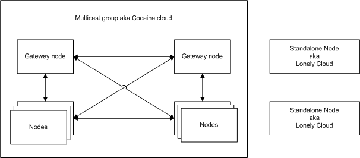

#Server configuration

The default configuration file of the Cocaine runtime after the installation is [/etc/cocaine/cocaine-default.conf](https://github.com/cocaine/cocaine-core/blob/v0.11/debian/cocaine-runtime.conf). It has JSON format. The most parameters that you can specify there just replace default values.

Let's consider questions of network communications in Cocaine.



Cocaine cloud consists of multiply nodes combined to one multicast group. Gateways are the entry points of a cloud and they are the balancers of load. Any node of a cloud can be a gateway, even all of them. If you want to create just one node there is no need to configure gateway. 

How nodes learn about each other and how do they know which services are run on each? There is a Locator core service runs on each node for this purpose.

You should use [locator](#locator) and [network](#network) sections of configuration file to manipulate with aspects of Cocaine network.

Other configuration options regulate such parameters of node like [running services](#services), [storage](#storages) and [logger](#loggers) components description and a [paths](#paths) settings.

The minimalistic working configuration looks like follows:

```json
{
    "version": 2,
    "services": {
        "logging": {
            "type": "logging"
        },
        "storage": {
            "type": "storage",
        },
    },
    "storages": {
        "core": {
            "type": "files",
            "args": {
                "path": "/var/lib/cocaine"
            }
        },
    },
    "loggers": {
        "core": {
            "type": "syslog",
            "args": {
                "identity": "cocaine",
                "verbosity": "info"
            }
        }
    }
}
```

It's enough for Lonely Cloud node start and serve. 

You need to **remember** that the [paths](#paths) used by default should exist and be available for changes by user who runs node.

The first parameter of the file is `"version": 2` it should be used as is, no changes.

Sections of the configuration file:

| Section | Description |
|---------|-------------|
| [paths](#paths)   | Required paths.  |
| [locator](#locator) | Configuration of the Locator service. |
| [network](#network) | Parameters, that makes a cloud from nodes. |
| [services](#services) | Declaration of used services, custom and core. |
| [storages](#storages) | Configuration of backends for Cocaine storage service. |
| [loggers](#loggers) | Logger services configuration. |

##Paths

Defaults:

```
"paths": {
    "plugins": "/usr/lib/cocaine",
    "runtime": "/var/run/cocaine"
}
```

| Parameter | Description |
|-----------|-------------|
| plugins | Path to plugin libs (services, storages, loggers etc.). |
| runtime | Path to the pid-file of the process. |


##Locator

Defaults:

```
"locator": {
    "hostname": "",
    "endpoint": "::",
    "port-range": ""
}
```

| Parameter | Description |
|-----------|-------------|
| hostname | Local hostname which will be used for Locator publishing. Resolved with the system calls by default. |
| endpoint | Bind address. Can be specified as a hostname or an address. Locator is bound to all interfaces by default.|
| port-range | Range of ports available for services binding. If not specified, services are bound to any free port of operating system choice. |

##Network

Possible subsections:

```
"network": {
    "group": "",
    "gateway": {
        "type": "",
        "args": { ... }
    }
}
```

| Parameter | Description |
|-----------|-------------|
| group | Multicast address which will be used for Cocaine node self-publishing. It is not required for the standalone nodes. |
| gateway | Gateway is an entry point into the cloud for the clients. It can be of 2 **types**: `adhoc` without any **args**, and `ipvs` with some of them. |

`adhoc` gateway balances load randomly, maybe it's not the most intelligent algorithm, but it works quite well.

`ipvs` has the next parameters:

Defaults:

```
"gateway": {
    "type": "",
    "args": {
        "scheduler": "wlc",
        "weight": "1",
        "port-range": ""
    }
}
```

| Parameter | Description |
|-----------|-------------|
| scheduler | It is the name of ipvs scheduler. You can get the list of them with the `man ipvsamd` command.|
| weight | Weight of the node. By default all Cocaine nodes have weight 1.|
| port-range | Range of ports available for services binding. If not specified, services are bound to any free port of operating system choice.|

When using `ipvs`-gateway, you should be shure that `ip_vs` module is loaded into your Linux kernel.
##Services

Defaults:

```
"services": {
    "logging": {
        "type": "logging"
    },
    "storage": {
        "type": "storage",
    },
    "node": {
        "type": "node",
        "args": {
            "runlist": "default"
        }
    }
}
```

Services are apps, that start with the Cocaine runtime instead of custom apps, that run by the `node` service. 

Cocaine has the next services by default that can be configured in this section:

  *  `logging` - logger service. It can be used by custom apps and by the client to write logs.
  *  `storage` - backend. It can be used by custom apps and by the clients to store data.
  *  `node` - this service is designed to run custom apps.
  *  `urlfetcher` - HTTP-client.
  
You can write you own service. How you can do this described in corresponding part of the documentation.

###Logging configuration
Service `logging` can use any logger configured in [loggers](#loggers) section. Name of logger is designated in `backend` argument like follows:

```
"logging": {
    "type": "logging"
    "args": {
        "backend": "core"
    }
},
```
By default (when `backend` is not configured) service use `core` logger.

###Storage configuration
Service `storage` can use any backend configured in [storages](#storages) section. Name of backend is designated in `backend` argument like follows:

```
"storage": {
    "type": "storage"
    "args": {
        "backend": "core"
    }
},
```
By default (when `backend` is not configured) service use `core` backend.

###Node configuration
Service `node` has the only parameter `runlist` that designates name of a list. 

Runlist is a JSON file that contains the names of apps with their profiles in such a manner of:

```
{
    "app_1": "profile",
    "app_2": "profile",
    "app_3": "another_profile",
    ...
}
```

Runlists are uploaded to the server with the command

```
cocaine-tool runlist upload --name list_name --runlist path_to_JSON
```

###Urlfetcher configuration
Should be configured as:

```
"urlfetch": {
    "type": "urlfetch"
}
```


##Storages
This section describes parameters of backends for `storage` type of services. The Cocaine cache is also configured in this section.

Cocaine `core`  backend is a filesystem, and its only parameter is a path to data. By default it configured as follows:

```
"core": {
    "type": "files",
    "args": {
        "path": "/var/lib/cocaine"
    }
}
```

It should present in any Cocaine configuration because it used by Cocaine core to store apps, manifests, profiles and other service information. Cocaine doesn’t use this storage as a service. This means that if we omit `core` description in `storages` Cocaine runtime will not start, but if we omit description of `storage` in `services` section only apps than use `storage` service will fail. For example, `cocaine-tool` will not upload custom app to the server if `storage` service is not configured in `services` section.

One more Cocaine storage is `cache`. It cann't be used with the `storage` services. It configuration looks like:

```
"cache": {
    "type": "files",
    "args": {
        "path": "/var/cache/cocaine"
    }
}
```

The only parameter of `cache` is `path` to the cache data. Cache is used to store apps, manifests, profiles and other service data, and Cocaine runtime read all of this info from cache. This means that if we will try to upload some app iteratively it will not be updated until we clean the cache.

In case when you just start experiments with the Cocaine, delete this section from the configuration file if it is there. When it is not configured Cocaine doesn't use cache.

##Loggers
This section contains description of logger configuration.

Default configuration:

```
"loggers": {
    "core": {
        "type": "syslog",
        "args": {
            "identity": "cocaine",
            "verbosity": "info"
        }
    }
}
```

[Back to Contents](contents.md)