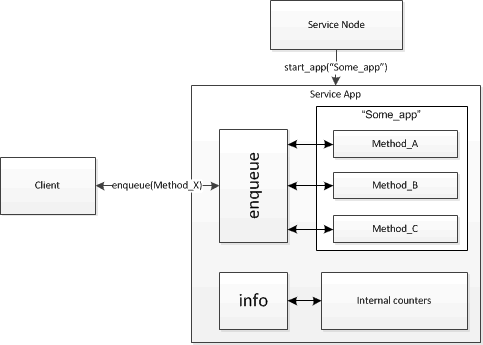

#App service

##Description

Custom apps are started as services, each as a separate service. Client interface of apps should be called through the interface of `app` service which we consider in this section.



##Handles

|**Handle**|**Description**|
|----------|---------------|
|enqueue|Call app method.|
|info|Get app statistics.|


```
enqueue(app_method_name, data)
info()
```

**Parameters**

|**Parameter**|**Description**|
|-------------|---------------|
|app_method_name|Name of the published app method.|
|data|An arbitrary sequence of bytes, which app gets on  its method call.|


**Return value**

`enqueue` returns an arbitrary sequence of symbols, it is a result of app method call and should be treated in appliance with the return type of that method.

`info` returns struct with information on app usage.
